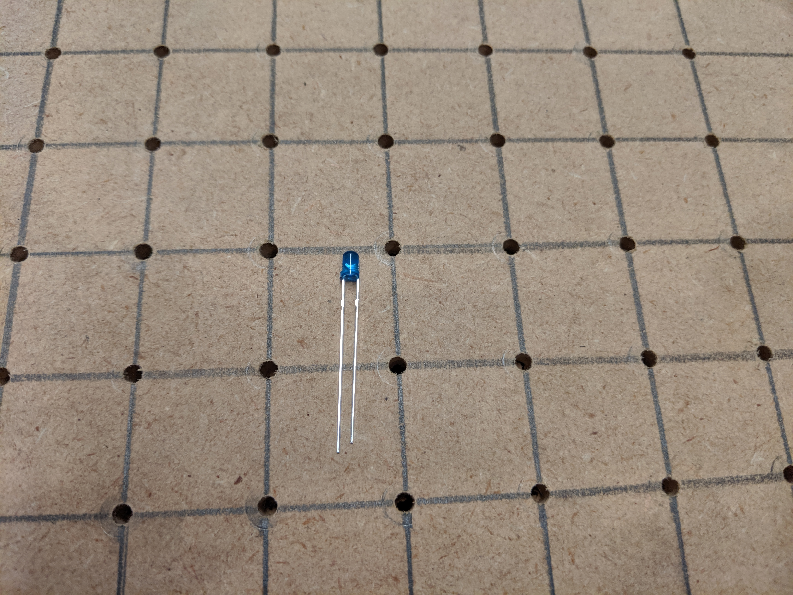
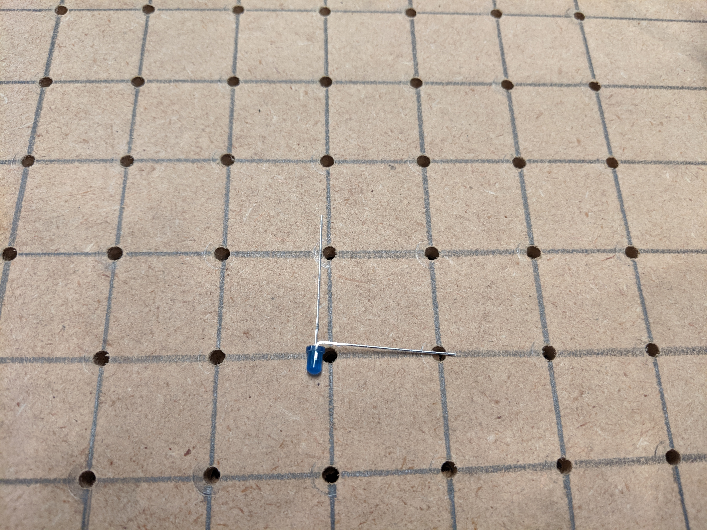
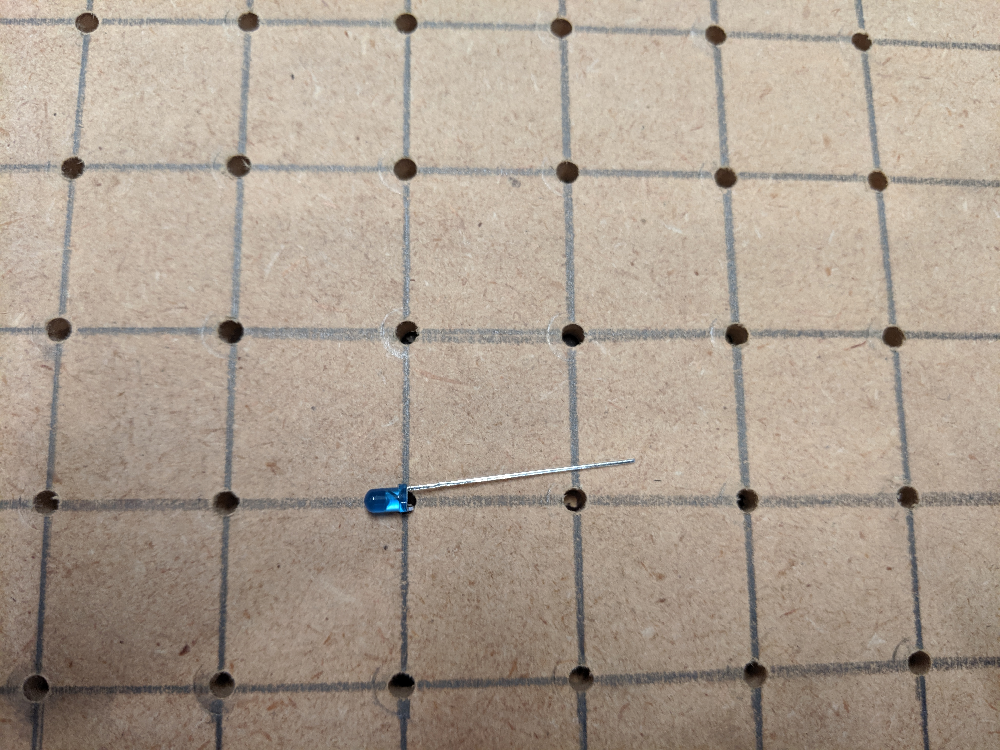
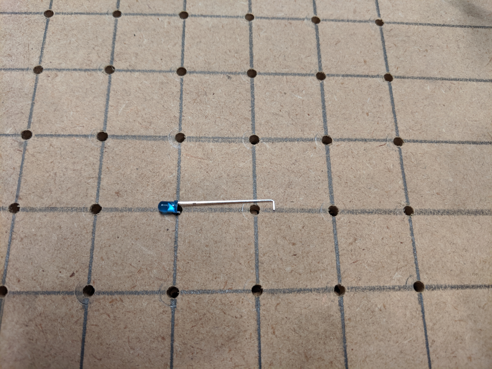
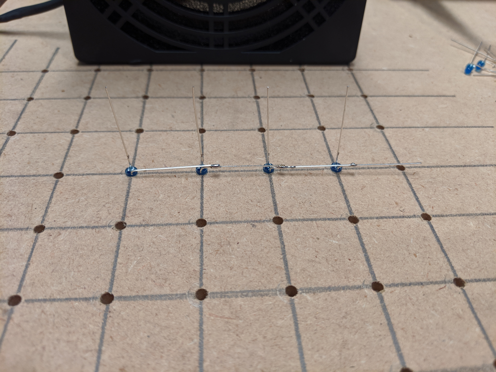
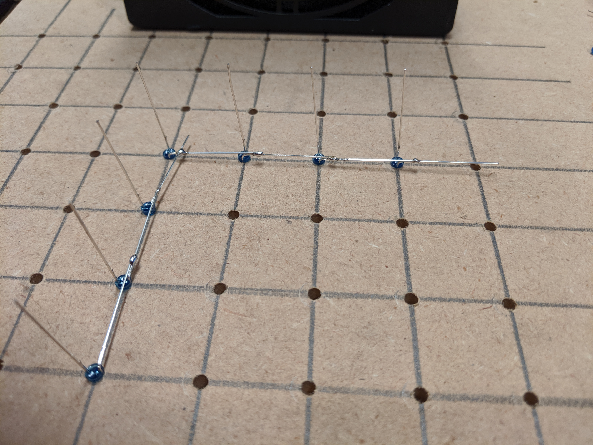
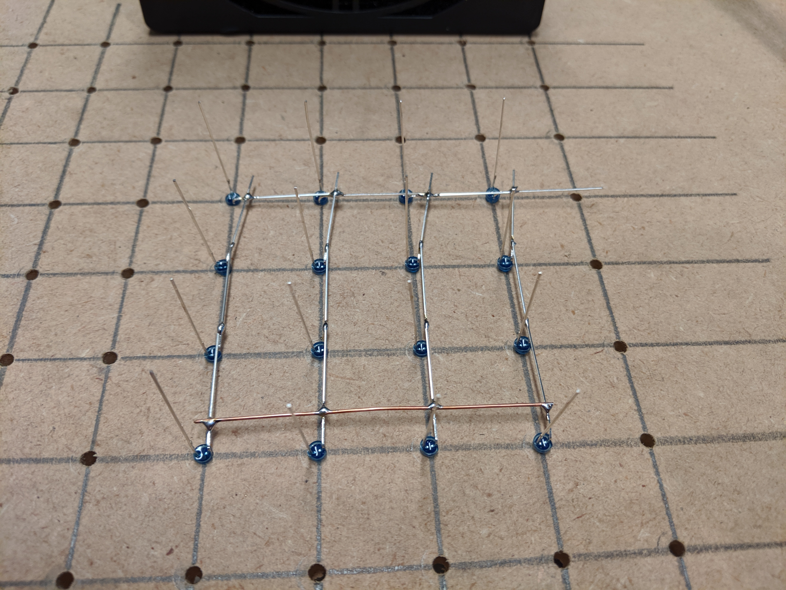
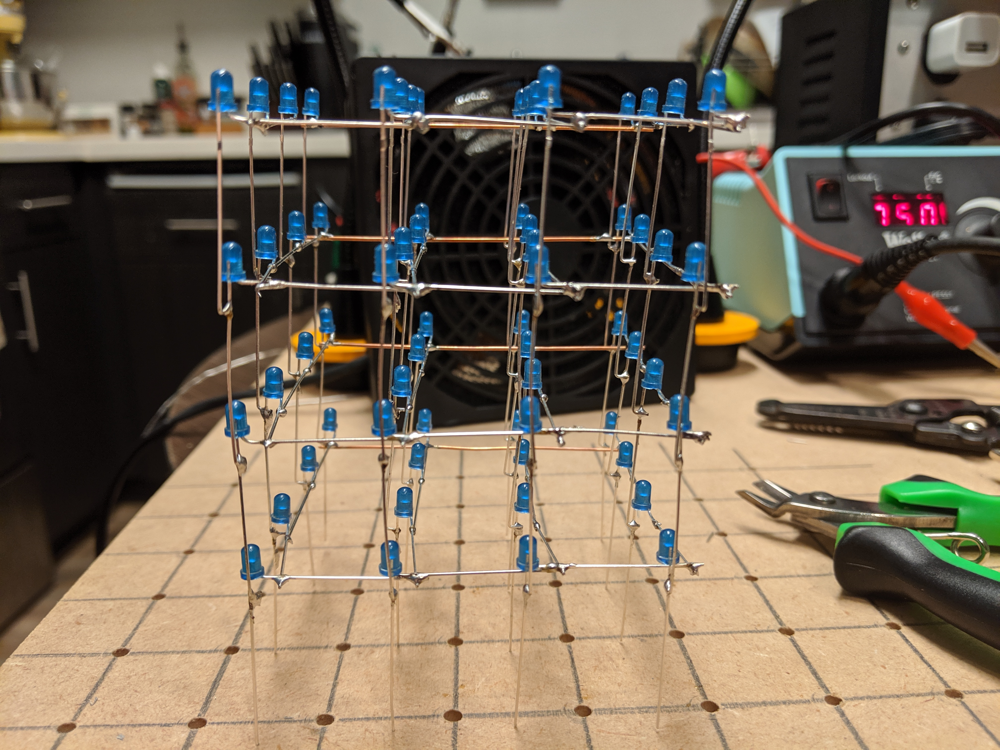
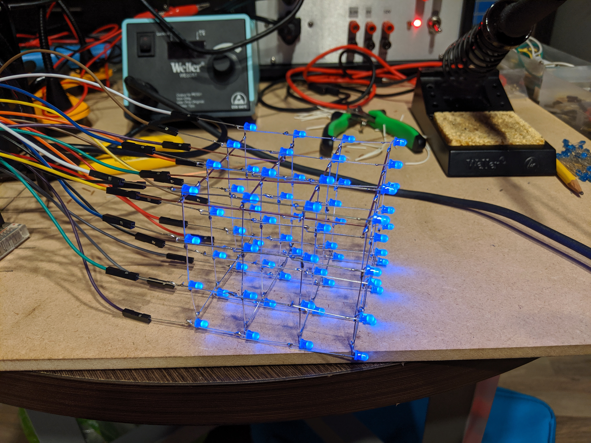
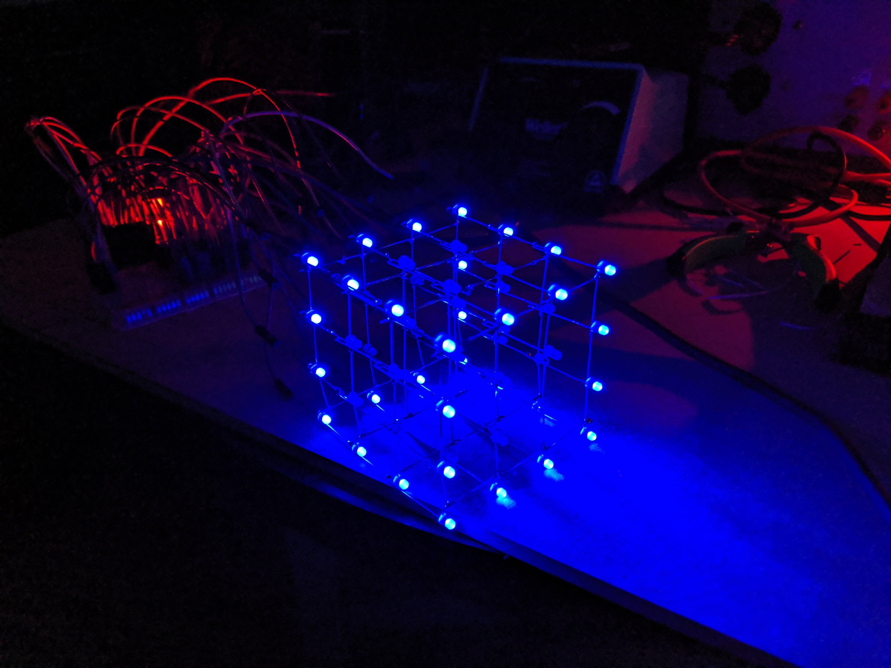

4x4x4 LED Cube Build
====================

Before attempting a full 8x8x8 cube, I started by creating a 4x4x4 one.

Supplies
--------

Materials:

 * 64 LEDs (I chose blue, diffuse is better)
 * 3 ft solid core wire (I had some 22 guage lying around)
 * 15 ft small guage wire (rough approximation, for routing on protoboard)
 * 16 resistors (For mine, I used 200 ohms)
 * 1 large protoboard (Should be at least 4 inches in the smaller dimension)
 * 1 arduino (I used a mega 2560, but an uno should work too)
 * 1 small protoboard (Optional, used to make easy connection to arduino)
 * 20 pin headers (Optional, used to make easy connection to arduino)

Tools:

 * Soldering iron (Ideally a nicer one since you will be doing a lot of soldering)
 * Solder (You will need a pretty good amount of this)
 * Helping hands (Very useful to hold things in place)
 * Soldering fan (Safety first)
 * Solder sucker (Or whatever tool you prefer to unsolder mistakes)
 * Breadboard (Mainly used for testing LEDs)

Procedure
---------

The first step is to create a template.
I tried a 1" separation initially, but had to solder too close to the LEDs and was worried about burning them out.
Instead, I found 7/8" to be a good distance.
Because I plan to also make an 8x8x8, I made the template that size, but feel free to make it just 4x4.
I chose a hole size that fit the LEDs snugly, 1/8" worked best for me.

Next is to test and shape all the LEDs.
While not strictly required, it will be very annoying to replace any LEDs, so it is best to test each one.
Once all are known to be good, the cathode and anode must be bent to create the structure of the cube.

The way to bend it is to orient the led to be upside down, the anode on the left, the cathode on the right.
Bend the cathode forward till it is at a right angle.
1/4th of them are done.
They will make the bottom layer.
For the remaining layers, bend the anode left a little, and then use some pliars to bend the last tip right at a right angle.
This way the LEDs can be stacked directly on top of each other.

The next step is to create the layers.
First, place one row as shown below and solder them together.

Next, add each column, one at a time.

Finally, use some solid core wire to add some structure to the other end of the columns.
I was able to make the wire straight by holding each end with some pliars and pulling.
The wire lengthens slightly, and in the process straightens out better than you could do manually.

Repeat this process 3 more times to make all the layers.
Make sure all the LEDs where you only bent the cathode are in the same layer.
After each layer was completed, check all the LEDs again to make sure they are all good.
It is easier to fix it now than in it's final configuration.
To test, attach a ground wire to the cathode sticking out, or any horizontal wire.
Then touch your positive wire against each vertical post.

To finish the cube portion, each layer needs to be soldered to each other.
Start by putting the top layer in the template.
Then roughly position it using helping hands.

Make one corner good height-wise and solder it.
Then do the remaining corners.

Carefully check that the layers are lined up in every way.
This may require some resoldering, along with tilting wires.

Solder the remaining anodes, making sure that the two layers stay lined up.

Finally, test all the LEDs in both rows again like you did for each layer.
This will ensure all the anodes have strong connections through layers and nothing is burned out.

Repeat those steps twice more, making sure the straight anode layer is the bottom layer.

You will need a connection from each cathode layer to the bottom of the cube.
Straighten some more solid core wire and make a small right angle at the end.
Solder one of these L pieces to each layer.
I attached them to the existing solid core wire, but anywhere will do.

The cube is now ready to be tested.
I used male to female jumper wires to connect all the anodes and cathodes to a breadboard.
Then I attached resistors to all the anodes and connected everything to the arduino.

The first test was to make sure everything lit up.
I programmed all the pins for the anodes to write HIGH and all the cathodes to write LOW.

Then, when I made sure everything was lighting up, I tried making the cube display a pattern with multiplexing.
Multiplexing entails lighting one layer up at a time, and rotating through them fast enough that the eye sees them all lit at once.
The basic loop is:

    Set all cathodes to HIGH
    Turn on anodes to first layer that will be lit
    Set first layer cathode to LOW
    Set first layer cathode to HIGH
    Turn on anodes to second layer that will be lit
    Set second layer cathode to LOW
    Repeat for all layers
    Repeat this loop continuously

With this technique, you can make it appear that just the outline is lit, which you couldn't otherwise display.

