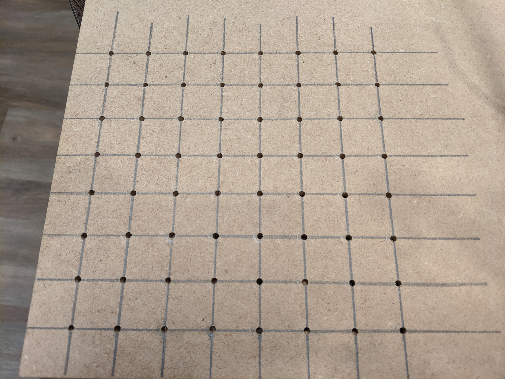

4x4x4 LED Cube Build
====================

Before attempting a full 8x8x8 cube, I started by creating a 4x4x4 one.

Supplies
--------

Materials:

 * 64 LEDs (I chose blue, diffuse is better)
 * 3 ft solid core wire (I had some 22 guage lying around)
 * 15 ft small guage wire (rough approximation, for routing on protoboard)
 * 16 resistors (For mine, I used 200 ohms)
 * 1 large protoboard (Should be at least 4 inches in the smaller dimension)
 * 1 arduino (I used a mega 2560, but an uno should work too)
 * 1 small protoboard (Optional, used to make easy connection to arduino)
 * 20 pin headers (Optional, used to make easy connection to arduino)

Tools:

 * Soldering iron (Ideally a nicer one since you will be doing a lot of soldering)
 * Solder (You will need a pretty good amount of this)
 * Helping hands (Very useful to hold things in place)
 * Soldering fan (Safety first)
 * Solder sucker (Or whatever tool you prefer to unsolder mistakes)
 * Breadboard (Mainly used for testing LEDs)

Procedure
---------

The first step is to create a template.
I tried a 1" separation initially, but had to solder too close to the LEDs and was worried about burning them out.
Instead, I found 7/8" to be a good distance.
Because I plan to also make an 8x8x8, I made the template that size, but feel free to make it just 4x4.
I chose a hole size that fit the LEDs snugly, 1/8" worked best for me.

Next is to test and shape all the LEDs.
While not strictly required, it will be very annoying to replace any LEDs, so it is best to test each one.
Once all are know to be good, the cathode and anode must be bent to create the structure of the cube.

